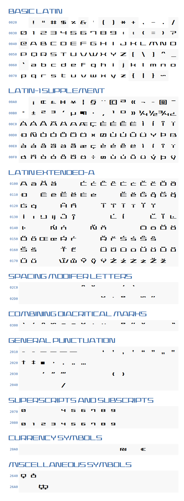

--

The _actual font in the series_ is Seele Two by Maniackers Design,
and it is available free for non-commercial use
[here.](https://mksd.jp/seele.html)

Given that, I won't work on this clone any further. 

--

A draft free font in imitation of that used at the
‘Asticassia School of Technology’ in
_Mobile Suit Gundam: The Witch from Mercury_.

If you only want to use the font,
the TTF (for local computer use) or WOFF (for web use)
files are all you need.

The ‘Wide’ version matches fairly closely the text as seen on school tablet
screens.
The ‘Narrow’ version is close to the text in duels and signs.

