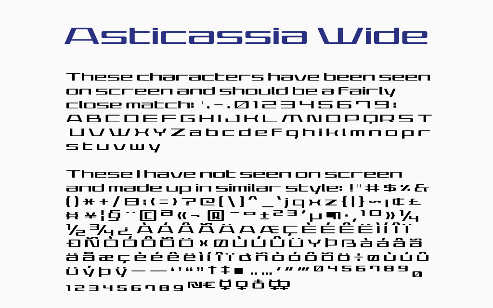

# Asticassia Wide

A draft free font in imitation of that used at the
‘Asticassia School of Technology’ in
_Mobile Suit Gundam: The Witch from Mercury_.

Note: **I may well never touch this again.**
Therefore, I am providing it under a
[CC0 license](https://creativecommons.org/publicdomain/zero/1.0/)
so that others can work on it unencumbered.
[AsticassiaWide.sfd](AsticassiaWide.sfd)
is the [FontForge](https://fontforge.org/) source.

If you only want to use the font,
[AsticassiaWide.ttf](AsticassiaWide.ttf) is all you need.

This matches fairly closely the text as seen on school tablet screens.
The text in duels and signs is narrower; scale to 2/3 (67%) for a close
match. 

These characters have been seen on screen and should be fairly close
to the original:
' , - . 0 1 2 3 4 5 6 7 9 : A B C D E F G H I J K L M N O P Q R S T
 U V W X Y Z a b c d e f g h i k l m n o p r s t u v w y

These I have not seen on screen and made up in similar style:
! " # $ % & ( ) * + / 8 ; < = > ? @ [ \\ ] ^ \_ ` j q x z { | } ~
¡ ¢ £ ¤ ¥ ¦ § ¨ © ª « ¬ ­ ® ¯ ° ± ² ³ ´ µ ¶ · ¸ ¹ º » ¼ ½ ¾ ¿
À Á Â Ã Ä Å Æ Ç È É Ê Ë Ì Í Î Ï Ð Ñ Ò Ó Ô Õ Ö × Ø Ù Ú Û Ü Ý Þ ß
à á â ã ä å æ ç è é ê ë ì í  î  ï  ð ñ ò ó ô õ ö ÷ ø ù ú û ü ý þ ÿ
– — ‘ ’ “ ” † ‡ • ‥ … ′ ″ ‴ ⁰ ⁴ ⁵ ⁶ ⁷ ⁸ ⁹ ₀ ₁ ₂ ₃ ₄ ₅ ₆ ₇ ₈ ₉
₪ € ☿︎ ♀︎ ♁︎ ⚢︎

